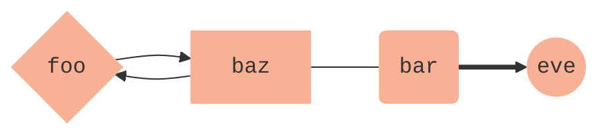

# bulma-base

Basic responsive theme for Hugo static sites using [Bulma](https://bulma.io/) framework.

#### Example sites created using **bulma-base**
- [Biotop Science Collective](http://biotop.github.io/biotop-new)


## Setup and Requirements
- hugo "full version" to compile `sass`
- tested with Hugo v0.57.2
- Tranlslation strings (i18n) under '/hugo-site/i18n/en.toml', etc. (see example page for template)
- Custom `.sass`-file for injecting custom variables (colors, fonts) under `/hugo-site/assets/custom.sass`
- Author data under `/hugo-site/data/authors.toml` (see example page for template)

## Functionality

##### Default menus
Responsive sidebar menu on non-touch devices, burger menu on all devices

##### Multilingual support
Supports Hugo's multilingual mode throughout. Requires translation data under '/hugo-site/i18n/en.toml', etc

##### Feature Content
Images, Videos (embedded Vimeo or static)

##### Calendar
The calendar is implemented using [Bulma Calendar extension](https://creativebulma.net/product/calendar/demo). Modified scripts allow blogposts that have `.Params.date` and `type="blog"` or `type="event"` to be displayed in the calendar.

##### Timeline
Implemented using [Bulma Timeline extension](https://wikiki.github.io/components/timeline/). In order for the partial to work correctly, provide a provide a data file under `hugo-site/data/timeline.toml`, specify the key in the frontmatter of the content and provide the following data:

```toml
[key]
  [key.year]
    name = "year"
    [[key.year.events]]
      month = "july"
      location = "Location 1"
      title = "Title 1"
      type = "What Happened"
      link = "/link/to/page"
      featured = "/path/to/image.jpg"
    [[key.year.events]]
      month = "November"
      location = "Location 2"
      title = "Title 2"
      type = "What Happend"
      link = "/link/to/page"
      featured = "/path/to/image.jpg"
```
##### Modified figure shortcode
Gets language relative path and returns framework consistent image element

##### MathJax
The theme supports rendering of Latex-style equations directly from within Markdown using MathJax.

###### mhchem
You can conventiently render chemical formulae and chemical equations using `mhchem`.

```
  $\ce{C6H12O6 + O2 -> 6H2O + 6CO2}$
```

renders to: $\ce{C6H12O6 + O2 -> 6H2O + 6CO2}$

###### Mermaid.js
Draw flowcharts, Gantt charts and sequence diagrams using `mermaid.js` via a

```markdown

graph LR
      A-->B[baz]
      B-->A{foo}
      B---C(bar)
      C==>D((eve))

      class A,B,C,D myNodes;
      classDef myNodes stroke-width:0px,font-family:monospace,font-weight:400, fill:#F8B195;

```




##### Kekule.js


##### Citation and Reference Shortcodes

## Customisation
`main.sass` will automatically look for the file `hugo-site/assets/custom.sass` use this file to specify custom styling.
